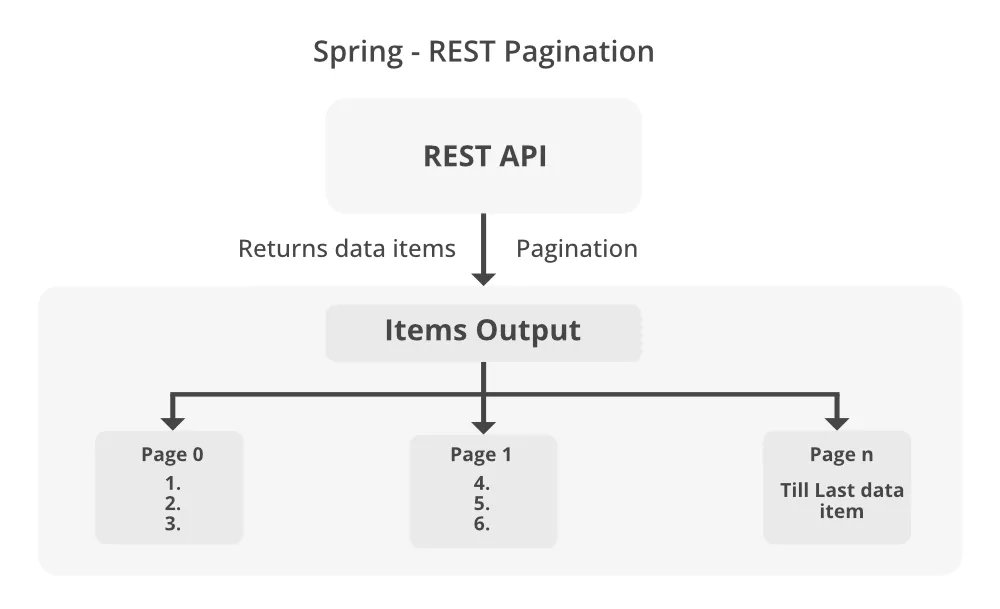

## 📚 Was ist Pagination?

**Pagination** (Seitennummerierung) ist eine Technik in der Backend-Entwicklung, mit der große Datenmengen in kleinere, besser handhabbare Teile aufgeteilt werden. Dies erleichtert sowohl die Verarbeitung als auch die Darstellung der Daten in Anwendungen erheblich.

Durch die Reduzierung der Datenmenge, die gleichzeitig verarbeitet und an den Client gesendet werden muss, trägt die Pagination zur Leistungsverbesserung bei. Dies ist besonders nützlich in Szenarien mit großen Datenbeständen, da es die Antwortzeiten optimiert und den Speicherverbrauch minimiert.

--- 



## 🔁 Wie funktioniert Pagination in RESTful APIs?

Die Seitennummerierung wird typischerweise in RESTful APIs verwendet, bei denen der Client bestimmte Seiten von Daten mit Parametern wie `pageNumber` (Seitennummer) und `pageSize` (Seitengröße) anfordert.

Der Backend-Server ruft dann nur den angeforderten Teil der Daten aus der Datenbank ab, was zu effizienteren und ressourcenschonenden Antworten führt.

--- 
## ✅ Vorteile von Pagination (Seitennummerierung)

Die Implementierung von Pagination in Webanwendungen bringt eine Vielzahl von Vorteilen mit sich, insbesondere bei der Arbeit mit großen Datenmengen:

### ⚡ 1. Leistungsoptimierung

Das Laden eines großen Datensatzes auf einmal kann ineffizient sein und erhebliche Mengen an Speicher und Rechenleistung erfordern.  
**Pagination begrenzt die verarbeiteten und übertragenen Datenmengen pro Anfrage**, was zu kürzeren Antwortzeiten und einer geringeren Serverauslastung führt.

---

### 🧑‍💻 2. Verbesserte Benutzererfahrung

Benutzer müssen nicht auf die vollständige Datenmenge warten – stattdessen erhalten sie schnell eine **handhabbare Teilmenge** der Daten.  
Dies verbessert die Interaktion, besonders bei Benutzeroberflächen mit Listen, Tabellen oder Suchergebnissen.

---

### 🌐 3. Effizientere Nutzung der Netzwerkbandbreite

Pagination reduziert die **übertragene Datenmenge**, da nur Teilmengen gesendet werden.  
Das ist besonders vorteilhaft in mobilen oder netzwerkbegrenzten Umgebungen.

---

### 📈 4. Skalierbarkeit

Für Datenbanken mit Millionen von Einträgen ist Pagination unverzichtbar.  
Nur ein Teil der Daten wird im Speicher gehalten und verarbeitet – was **die Skalierbarkeit der Anwendung erheblich verbessert.**

---

### 🧰 5. Ressourcenmanagement

Durch die segmentierte Datenverarbeitung wird das Risiko einer **Systemüberlastung minimiert**.  
Das Ergebnis: Stabilere und widerstandsfähigere Anwendungen unter hoher Last.

---

### 🔄 6. Vereinfachte Datenverarbeitung

Kleinere, paginierte Datenmengen lassen sich **einfacher sortieren, filtern oder weiterverarbeiten** – ohne dass das gesamte Dataset auf einmal benötigt wird.

___ 
## 🧩 Schritt 1: PersonalRepository – Definition und Seitennummerierung

In diesem Schritt definieren wir das `PersonalRepository`, das die `JpaRepository`-Schnittstelle erweitert. Dadurch erhalten wir automatisch grundlegende CRUD-Operationen (Create, Read, Update, Delete) von Spring Data JPA.

Zusätzlich implementieren wir eine benutzerdefinierte JPQL-Abfrage zur Unterstützung der Pagination:

```java
@Repository
public interface PersonalRepository extends JpaRepository<Personal, Long> {

    @Query("from Personal")
    Page<Personal> findAllPageAble(Pageable pageable);

}
``` 
## 🔍 Erklärung:
#### •	@Query("from Personal") – Eine einfache JPQL-Abfrage, die alle Personal-Datensätze zurückgibt.
#### •	Pageable pageable – Ermöglicht die Übergabe von Seitennummer und Seitengröße über die Anfrage.
#### •	Rückgabe: Page<Personal> – Enthält eine einzelne Seite von Personal-Daten sowie Metainformationen wie Gesamtseitenanzahl, aktueller Index usw.
### ➡️ Diese Methode bildet die Grundlage für eine performante und skalierbare Datenabfrage mit Pagination.

___ 
## 🧩 Schritt 2: Service-Schicht – PersonalServiceImpl

In dieser Phase implementieren wir die Service-Schicht durch die Klasse `PersonalServiceImpl`, die das Interface `IPersonalService` implementiert.

```java
@Service
public class PersonalServiceImpl implements IPersonalService {

    private final PersonalRepository personalRepository;

    public PersonalServiceImpl(PersonalRepository personalRepository) {
        this.personalRepository = personalRepository;
    }

    @Override
    public Page<Personal> findAllPageAble(Pageable pageable) {
        Page<Personal> page = personalRepository.findAllPageAble(pageable);
        return page;
    }
}  
``` 
___ 

## 🔍 Erklärung:
#### •	@Service: Markiert die Klasse als Service-Komponente für Spring’s Komponenten-Scanning.
#### •	PersonalRepository: Wird per Konstruktor-Injektion eingebunden.
#### •	findAllPageAble(Pageable pageable): Ruft die Repository-Methode auf und gibt eine Seite mit Personal-Daten zurück.

### ➡️ Die Service-Schicht dient als Vermittler zwischen Controller und Repository und kapselt die Geschäftslogik.
### Dies sorgt für eine saubere Trennung der Verantwortlichkeiten gemäß der Schichtenarchitektur (Layered Architecture).

___
## 🧩 Schritt 3: REST-Controller – RestControllerImpl

In diesem Schritt erstellen wir die Controller-Schicht, welche die eingehenden HTTP-Anfragen behandelt. Diese Schicht ist der Einstiegspunkt für externe Clients (z. B. Frontend-Anwendungen).

```java
@RestController
@RequestMapping("/rest/api/personal")
public class RestControllerImpl implements IRestController {

    private final IPersonalService personalService;

    public RestControllerImpl(IPersonalService personalService) {
        this.personalService = personalService;
    }

    @GetMapping("/list/pageable")
    @Override
    public Page<Personal> findAllPageAble(@RequestParam(value = "pageNumber") int pageNumber,
                                          @RequestParam(value = "pageSize") int pageSize) {

        PageRequest pageable = PageRequest.of(pageNumber, pageSize);

        return personalService.findAllPageAble(pageable);
    }
} 
``` 
___ 
## 📬 Beispielhafte API-Antwort – Pagination in Aktion

Mit folgendem GET-Request rufen wir die erste Seite von Personal-Daten mit jeweils 2 Einträgen ab:

GET http://localhost:8080/rest/api/personal/list/pageable?pageNumber=0&pageSize=2 

___ 
Die API antwortet mit einem paginierten JSON-Objekt, das eine Liste von Personal-Datensätzen enthält, inklusive zugehöriger Abteilungsinformationen:

### 📦 Beispiel-Response (gekürzt):

```json
{
  "content": [
    {
      "id": 1,
      "firstName": "Yavuz",
      "lastName": "Ozmen",
      "department": {
        "id": 34,
        "location": "Istanbul",
        "name": "Yazilim"
      }
    },
    {
      "id": 2,
      "firstName": "Ahmet",
      "lastName": "Kuall",
      "department": {
        "id": 34,
        "location": "Istanbul",
        "name": "Yazilim"
      }
    }
  ]
} 
``` 
___ 
## 🔍 Erklärung:
#### •	content: Eine Liste von Objekten vom Typ Personal.
#### •	Jedes Personal-Objekt enthält Informationen wie id, firstName, lastName.
#### •	Das verschachtelte department-Objekt stellt die Beziehung zur zugehörigen Abteilung dar:
#### •	name: Name der Abteilung
#### •	location: Standort (z. B. Istanbul)

## ➡️ Dank der Verwendung von Pageable und Page<Personal> wird nur ein Teil der gesamten Datenmenge zurückgegeben.
## Dies macht die API effizienter, benutzerfreundlicher und skalierbarer – ideal für große Datenbestände.


## ✅ Systemanforderungen

Zum Bauen und Ausführen dieser Anwendung benötigen Sie:

- ☕ [**JDK 17 oder neuer**](https://jdk.java.net/17/)
- 🧱 [**Maven**](https://maven.apache.org/)
- 🐘 [**PostgreSQL**](https://www.postgresql.org/)
- ✨ [**Lombok**](https://projectlombok.org/)
- ✨ [**JPA**](https://projectlombok.org/) 

___ 
> ⚠️ **Hinweis für Leser:innen:**

### Dieser Abschnitt diente in erster Linie dazu, ein grundlegendes Verständnis für das Konzept der Pagination zu vermitteln.  
### Ab diesem Punkt jedoch wird eine **architekturbasierte, realitätsnahe Code-Struktur** präsentiert, wie sie typischerweise in professionellen Enterprise-Projekten verwendet wird.

### 🔍 Bitte analysieren Sie den nachfolgenden Code sorgfältig – hier beginnt der praktische Teil, der in echten Softwareprojekten zum Einsatz kommt.

### Viel Spaß beim Coden und happy Pagination! 
# 😊
